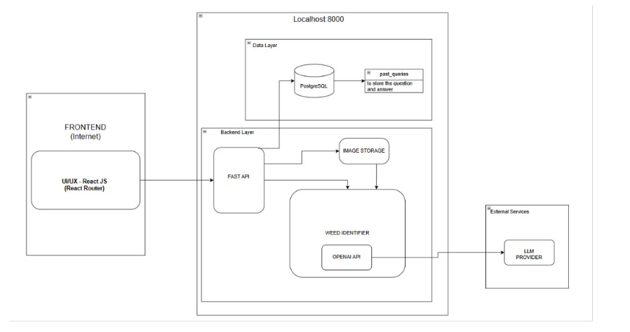

# Weed Identifier and Control Measures

## Problem Statement

Farmers frequently misidentify noxious weeds because many invasive species share similar traits. For example, bull thistle and musk thistle both present with purple flower 
heads but differ in lifecycle and bract structure. 

Farmers would like help answering questions like: 

 “I have a weed with Purple flower heads, nodding, spine-tipped bracts, rosette present last fall. Which thistle is this?” 

 To build a Farmer-facing UI for describing observed plant characteristics. 
The backend will identify the species and retrieve the plant's lifecycle information and necessary control measures.

## Overview

The application follows a clean client–server architecture with a React-based frontend and a FastAPI backend. The frontend, built using React and React Router, is responsible for rendering user interfaces. It communicates with the backend exclusively through RESTful API calls over HTTP.

The backend is implemented using FastAPI and runs on localhost. It acts as the central orchestration layer, handling request validation, authentication logic, business rules, and external API communication. User authentication actions such as signup, login, and logout are processed by FastAPI, which interacts with a PostgreSQL database to persist user details. Weed identification queries submitted by users are sent to the backend, which forwards the request to the OpenAI API (GPT-5.1) for intelligent analysis and response generation.

The generated answers, along with metadata such as confidence score, timestamp, and optional image references, are stored in PostgreSQL under a dedicated query table. Users can later retrieve their past queries via a separate API endpoint. This design ensures strong separation of concerns, secure handling of API keys, scalable backend logic, and a responsive frontend experience.

## Architecture Diagram:




## How to install and run the code:
1. Clone the latest code from the githib repo (main branch)
2. Setup react-router vite-server and python environment in VSCode
2. Add the below values in .env file:

    ```
    OPENAI_API_KEY={your openai api key}

    DATABASE_URL = {your local PostgreSQL DB connection URL}

    PRODUCTION=false
    ```

2. Run from terminal: 

    `pip install -r requirements.txt`


3. Setup your OPENAI_API_KEY in the .env file
4. Setup the PostgreSQL DB in local and use alembic to migrate the schema to PostgreSQL (Add DATABASE_URL is in .env file)

**Alembic commands:**

    alembic init <directory name>

    alembic  revision --autogenerate -m "Add new tables and columns"

    alembic upgrade head
    

5. From the root path of the folder, run the main.py using command: 

    `uvicorn main:app`

6. From the /frontend path , run the react-router server using command: 

    `npm run dev`


7. When the servers are up and running, the application will be accessible from the browser at http://localhost:5173/home


## Sample data set:


1. Sign-up and use that username and password to login

2. **Sample questions:**

"List effective mechanical, chemical, or biological control methods for musk thistle."

"I have a plant with slender stems, gray-green leaves, and distinctive pink to purple thistle-like flowers topped with dark-spotted bracts.What weed is it?"

"Describe the lifecycle and growth timing of Hoary Cress."

3. Further sample questions are provied in `sample_questions.csv` file


## Key decisions and trade-offs while building/designing the application:

1. **Decision:** To use GPT-5.1 for the analysis task.

    **Trade-off :** It is slower than most other lower models.Comparitivly high API costs, external dependency, added latency, and potential variability in answers.

     But the reasoning and identification of the plant from image is much better. The answer provided is also very much in detail.

2. **Decision:** Use a simple “prompt → OpenAI API → answer” flow, without agents or Retrieval-Augmented Generation (RAG).

    **Trade-off:** To keep the system lightweight and easy to maintain, at the cost of not leveraging project-specific documents and advanced multi-step tool usage.

    Without RAG it might be harder to maintain consistency, but the data required is mostly about weeds, herbicides, best practices which GPT-5.1 is good enough to provide.

3. **Decision:** Integrate a Guardrails-like framework around the OpenAI API to validate and constrain LLM outputs (schema enforcement, safety checks, content filters)

    **Trade-off:**
    This added architectural complexity, slightly higher latency, and more configuration and maintenance effort.
    But it improved safety and enforce structured outputs.

2. **Decision:** Use multipart/form-data so the same endpoint can accept text + optional image.

    **Trade-off:** Easy for forms and file uploads, but slightly more complex parsing than pure JSON and harder to test with some clients.

3. **Decision:** Return a structured JSON response (species_name,lifecycle_info,control_methods,confidence_score, summary) rather than a single blob of text.

    **Trade-off:** Easier UI rendering and storage/search later, but you must enforce schema and handle missing fields safely.

4. **Decision:** Do date filtering and keyword search in the React UI after fetching all past queries for a user.

    **Trade-off:**
    Simple to implement, responsive filtering without extra API endpoints.
    Does not scale well if a user has thousands of queries; might require server-side filtering or pagination later.

6. **Decision:** Use Base64 encoding to convert image/binary data into a text string (e.g., data URL) so it can be sent in JSON / stored or logged more easily.

    **Trade-off:** Using Base64 encoding for simplicity and easy transport of images as text, at the cost of larger payload size and extra encode/decode overhead.


